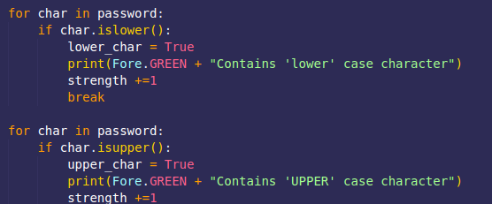
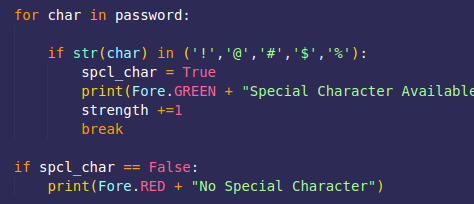
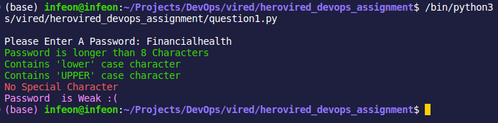
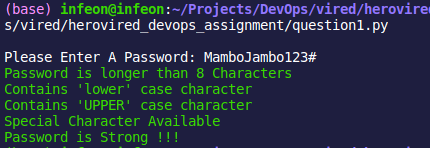
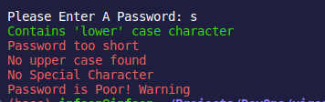
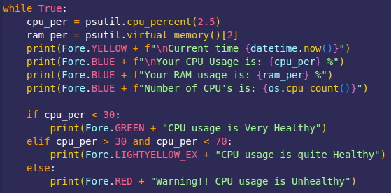
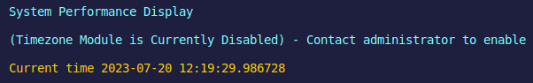
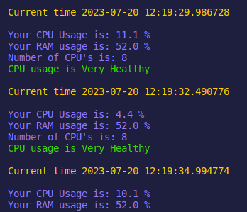
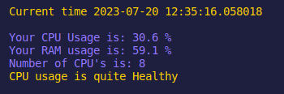
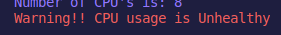

# Herovired_Devops
## This Is A Devops Assignment Repo
### Assignment 1 - Flask & Python

>#### Question 1: (solution in question1.py)
>
>* *Program checks for lower case, upper case, special characters and numerals/digits to approve if the provide password is Strong, Weak or Poor.*
>

>* *Special character check*
>
>

>* *Entering a short password, or without numerals or special characters would make it weak*
>

>* *If you enter a password that satisfies all the conditions, then the password is strong*
>

`from colorama import Fore` # Install as mentioned in requirements.txt 
>* *Importing 'colorama' allows the program to display print statements in various colours, hence I used green color to be a strong password and red colour to warn that the password is poor*

>* *If the password satisfies 1 or no conditions it is considered a weak password*
>

#### Question 2: (solution in question2.py)

`import psutil`
> *Importing this allows the program to use the psutil module that accesses the hardward information such as CPU and RAM utilisation*

> *Program checks the CPU, RAM usage and number of Cores to give its usage percentage, runs continuously using a while statement, refreshes every 2.5 seconds*

> *Tries to display timezone, since the module is not imported, it gracefully displays an alternate message. Also the program displays current date & time using the datetime module*

>* Displays that the CPU usage is Healthy

>* Displays that the CPU usage is Quite Healthy

>* Displays the CPU usage is Poor, Warning!!

###### Question 3: (solution in question3.py)

###### Displays that the CPU usage is Quite Healthy

###### Displays that the CPU usage is Quite Healthy

###### Displays that the CPU usage is Quite Healthy

###### Displays that the CPU usage is Quite Healthy

###### Displays that the CPU usage is Quite Healthy

###### Question 4: (solution in question4.py)

###### Displays that the CPU usage is Quite Healthy

###### Displays that the CPU usage is Quite Healthy

###### Displays that the CPU usage is Quite Healthy

###### Displays that the CPU usage is Quite Healthy

###### Displays that the CPU usage is Quite Healthy

